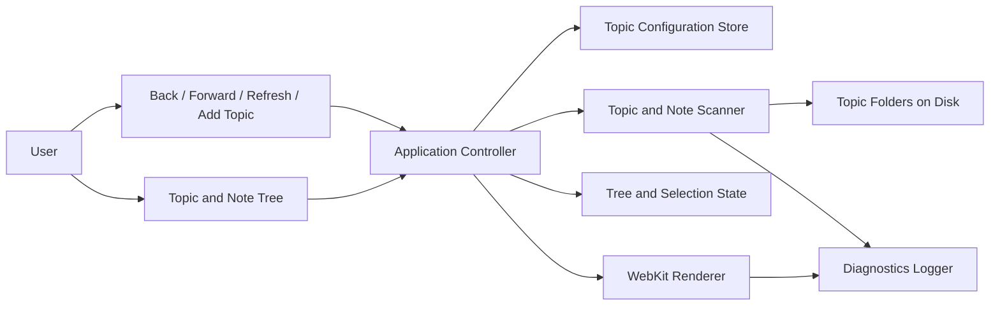
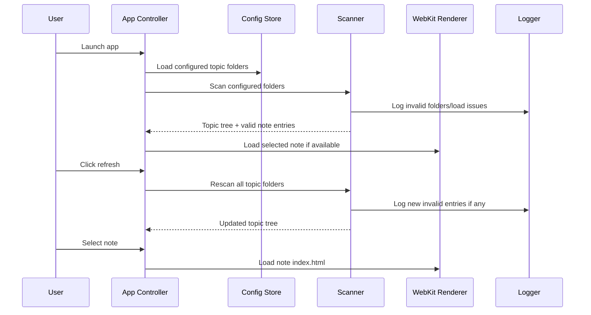

# Detailed Design: Rust macOS Notes Viewer

## Overview

This project is a native macOS notes viewer written in Rust for both Intel and Apple Silicon Macs. The application is viewer-only: it does not create, edit, or copy note data. Instead, it reads note content directly from one or more user-selected source folders on disk, where external agents may independently create or update notes.

Each configured source folder represents a topic. Inside each topic folder, each note is represented by a child folder. A valid note folder must contain an `index.html` file, and the note title is derived from the folder name. The application presents topics and notes in a hierarchical left pane and renders the selected note in a WebKit-based view in the right pane.

The first version deliberately excludes search and live filesystem watching. Users refresh manually using a browser-style refresh button, and navigate using back and forward buttons.

## Detailed Requirements

### Product scope

- The app must be a Rust-based macOS desktop application.
- The app must support both Intel and Apple Silicon Macs.
- The app must be viewer-only and must not edit or copy note content into an app-managed store.
- Search is out of scope for the first version.

### Note structure and source folders

- The user selects note source folders with a native folder picker.
- The user can configure multiple source folders over time.
- Each configured source folder represents a topic or subject.
- Notes remain grouped within their topic folder.
- Each note is represented by a folder inside a topic folder.
- Each valid note folder must contain an `index.html` file.
- The note title shown in the UI must be the note folder name.

### Refresh and folder lifecycle

- The app must directly read data from the original source folders on disk.
- External agents may update those folders independently of the app.
- The app must refresh via a manual refresh button rather than live automatic updates.
- If a configured topic folder is missing on a later launch, the app must prompt the user to select a replacement folder.

### UI behavior

- The app must use a two-pane layout.
- The left pane must show topics and notes in a hierarchical tree.
- Each topic must have a disclosure arrow similar to a code editor.
- Clicking the topic arrow must expand or collapse the notes under that topic.
- When expanded, notes must appear indented beneath the topic.
- The active topic and active note must both be highlighted in the left pane.
- Notes within a topic must be ordered by last modified time, most recent first.

### Note rendering and navigation

- The app must render note content using WebKit.
- The app must provide browser-style back, forward, and refresh controls.
- Back and forward navigation do not need to restore historical tree state or scroll position.
- When navigating to a note, the app may simply expand the topic containing the current note and highlight it.

### Invalid note handling and diagnostics

- If a note folder is missing `index.html`, the note must be hidden from the UI.
- If a note folder or its assets are broken, the app should hide it from the UI when it cannot be loaded as a valid note entry.
- Invalid notes and load failures must be written to an owner-readable error log for debugging.

## Architecture Overview

The application should be organized into a native Rust shell plus an embedded WebKit rendering surface:

- A native application shell manages the main window, layout, toolbar buttons, and event loop.
- A topic registry persists the list of configured source folders.
- A scanner/resolver enumerates topics and notes from disk during refresh.
- A tree state controller manages expand/collapse state, selection state, and sorting.
- A WebKit-backed rendering component displays the selected note’s `index.html`.
- A diagnostics subsystem records invalid notes, refresh failures, and rendering errors.

The architecture intentionally avoids live filesystem watchers in V1. The source of truth remains the filesystem, and the app only re-reads it on explicit refresh or startup.

### High-level architecture



### Runtime flow



## Components and Interfaces

### 1. Application Shell

Responsibilities:

- Own the app lifecycle and event loop
- Create the main window and split layout
- Host the left tree pane and right rendering pane
- Dispatch UI events to the controller

Likely implementation direction:

- Rust-native shell with a `wry`-hosted WebKit view
- Native folder dialogs via `rfd`

Primary interface:

- `launch()`
- `handle_ui_event(event)`

### 2. Topic Configuration Store

Responsibilities:

- Persist configured topic folders across launches
- Load saved configuration at startup
- Replace missing folders after user reselection
- Add new topic folders over time

Stored data:

- Topic identifier
- Display name
- Absolute source path

Primary interface:

- `load_topics() -> Vec<TopicConfig>`
- `save_topics(topics: &[TopicConfig])`
- `replace_topic_path(topic_id, new_path)`
- `add_topic(path)`

Notes:

- Configuration is app-managed.
- Note content is not app-managed.

### 3. Topic and Note Scanner

Responsibilities:

- Enumerate topic folders from configuration
- Enumerate note folders within each topic
- Validate presence of `index.html`
- Build note metadata
- Sort notes by last modified time descending
- Exclude invalid notes from returned UI data
- Write diagnostic logs for invalid entries

Primary interface:

- `scan_all(topics: &[TopicConfig]) -> ScanResult`
- `scan_topic(topic: &TopicConfig) -> TopicSnapshot`

Validation rules:

- Include only child directories
- Include only note folders containing `index.html`
- Use folder name as note title
- Use folder modification time for note ordering

### 4. Tree State Controller

Responsibilities:

- Maintain expanded/collapsed topics
- Maintain selected topic and selected note
- Ensure current-note topic is expanded when navigating or selecting
- Reconcile prior UI state after refresh where possible

Primary interface:

- `toggle_topic(topic_id)`
- `select_note(note_id)`
- `select_topic(topic_id)`
- `apply_refresh(snapshot)`
- `navigate_back()`
- `navigate_forward()`

History behavior:

- History tracks note navigation targets.
- Tree state is not restored historically beyond ensuring the current note is visible.

### 5. WebKit Renderer

Responsibilities:

- Render local note HTML from `index.html`
- Support browser-style back and forward behavior for note navigation
- Support reload for the current note
- Report loading failures to diagnostics

Primary interface:

- `load_note(note_path)`
- `go_back()`
- `go_forward()`
- `reload()`

Rendering behavior:

- The renderer should load the selected note from its on-disk `index.html`.
- Relative assets should resolve relative to the note folder.

### 6. Diagnostics Logger

Responsibilities:

- Record hidden invalid notes
- Record failed folder scans
- Record rendering/load failures
- Keep logs separate from the UI

Primary interface:

- `log_invalid_note(topic_path, note_path, reason)`
- `log_scan_error(topic_path, error)`
- `log_render_error(note_path, error)`

## Data Models

### TopicConfig

```text
TopicConfig
- id: String
- display_name: String
- path: PathBuf
```

Purpose:

- Persistent record of a configured source folder.

### NoteEntry

```text
NoteEntry
- id: String
- topic_id: String
- title: String
- folder_path: PathBuf
- index_html_path: PathBuf
- modified_at: SystemTime
```

Purpose:

- In-memory representation of a valid note discovered during a scan.

### TopicSnapshot

```text
TopicSnapshot
- topic: TopicConfig
- notes: Vec<NoteEntry>
- scan_warnings: Vec<ScanWarning>
```

Purpose:

- Result of scanning a single topic folder.

### ScanWarning

```text
ScanWarning
- path: PathBuf
- message: String
```

Purpose:

- Structured warning used for diagnostics when a note is excluded.

### AppState

```text
AppState
- topics: Vec<TopicSnapshot>
- selected_topic_id: Option<String>
- selected_note_id: Option<String>
- expanded_topic_ids: Set<String>
- history_back: Vec<String>
- history_forward: Vec<String>
```

Purpose:

- Current UI and navigation state.

## Error Handling

### Invalid note folders

- If a child folder lacks `index.html`, exclude it from the UI.
- Log the folder path and reason.

### Broken note assets or HTML load failure

- If a note appears valid at scan time but fails during rendering, keep the app running.
- Log the failure with the note path and failure context.
- Show a lightweight non-fatal error placeholder in the right pane instead of crashing.

### Missing configured topic folder

- If a configured folder no longer exists or is inaccessible at startup or refresh, prompt the user to select a replacement folder.
- If the user cancels, retain the topic configuration in an unresolved state and continue running with remaining valid topics.

### Refresh failures

- A failure in one topic scan must not fail the whole refresh.
- The refresh result should include all successfully scanned topics and log failures for the rest.

### Configuration persistence failures

- If topic configuration cannot be saved, the app should notify the user because this affects future launches.
- The current in-memory session can continue if the running state is otherwise intact.

## Testing Strategy

### Unit tests

- Validate note-folder detection based on presence of `index.html`
- Validate exclusion of invalid note folders
- Validate descending sort by folder modification time
- Validate topic grouping and note-title derivation from folder name
- Validate history behavior for note navigation
- Validate tree-state behavior that ensures the current topic expands when a note becomes active

### Integration tests

- Scan a temporary filesystem fixture containing multiple topics and mixed valid/invalid note folders
- Verify refresh updates the in-memory topic tree after filesystem changes
- Verify replacement flow for missing configured topic folders
- Verify configuration load/save behavior for multiple topic folders

### UI and behavior tests

- Verify topic disclosure expand/collapse behavior
- Verify active topic and active note highlighting behavior
- Verify selecting a note loads the corresponding `index.html`
- Verify refresh reorders notes when modification times change
- Verify back and forward navigate across note selections without requiring historical tree restoration

### Manual verification

- Run the app against a real topic folder set on macOS
- Confirm relative assets inside note folders render correctly in WebKit
- Confirm logs are generated for hidden invalid notes
- Confirm behavior on both Apple Silicon and Intel-targeted builds before release packaging

## Appendices

### Technology Choices

#### Web rendering

- Chosen: WebKit via `WKWebView`
- Rust integration direction: `wry`

Rationale:

- WebKit is an explicit product requirement.
- Apple documents `WKWebView` as the standard macOS web-content view.
- `wry` provides a practical Rust-accessible path to host a WebKit-backed webview on macOS.

#### Native folder picker

- Chosen direction: `rfd`

Rationale:

- It exposes native folder-picking APIs appropriate for first-run setup and adding topic folders.

#### Configuration storage

- Chosen direction: standard macOS app config location via `directories::ProjectDirs`

Rationale:

- Keeps application metadata separate from note content.
- Avoids violating the requirement not to copy notes into app-managed storage.

#### Logging

- Chosen direction: `tracing` plus `tracing-appender`

Rationale:

- Supports owner-readable persistent logs without surfacing invalid notes in the main UI.

### Research Findings Summary

- `WKWebView` is the macOS-native rendering primitive for embedded web content.
- `wry` is the strongest documented Rust path for embedding a WebKit-backed webview.
- Live filesystem watching is unnecessary for V1 and adds avoidable complexity given the manual refresh requirement.
- Multi-topic configuration should be stored separately from note content.
- Shipping for both Intel and Apple Silicon requires building both `x86_64-apple-darwin` and `aarch64-apple-darwin`; a universal binary can be produced by merging architecture-specific outputs.

### Alternative Approaches Considered

#### Tauri-style app shell

Pros:

- Strong ecosystem around Rust and webviews

Cons:

- More naturally suited to apps whose primary UI is web-based
- Adds architectural indirection for an app whose right pane is itself already rendering user HTML

Decision:

- Not preferred for V1.

#### Live filesystem watching in V1

Pros:

- More immediate updates when external agents modify content

Cons:

- Added complexity, reliability caveats, and state-churn concerns
- Conflicts with the explicit requirement for manual refresh

Decision:

- Defer until a later version if needed.

#### Copying notes into app-managed storage

Pros:

- More control over indexing and caching

Cons:

- Directly violates the viewer-only requirement
- Risks divergence from the source folders written by external agents

Decision:

- Rejected.

### Constraints and Open Decisions

- The minimum supported macOS version should be declared during implementation setup based on the final crate stack.
- The exact shell/layout library pairing around `wry` should be finalized in implementation, but the design assumes a native Rust shell rather than a web-UI-first shell.
