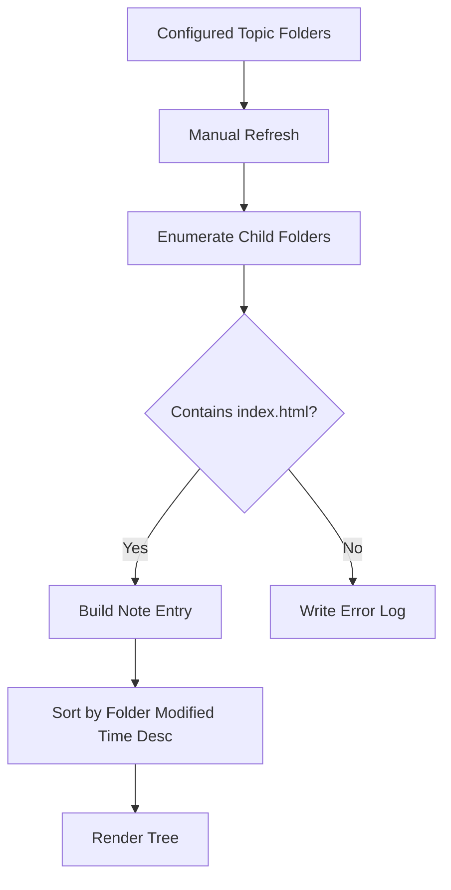

# Research: Filesystem Model and Folder Configuration

## Goal

Determine how to support:

- First-run folder picking
- Multiple configured topic folders
- Manual refresh
- Note ordering by last modified time
- Viewer-only operation over source folders that external agents may update

## Findings

### 1. Native folder picking is straightforward with `rfd`

The `rfd` crate provides native dialogs and includes both `pick_folder()` and `pick_folders()` APIs.

Implication:

- The first-run flow can use a native folder picker.
- “Add topic folder” can either open one folder picker per addition or use multi-folder selection if desired.

Sources:

- `rfd` crate docs: https://docs.rs/rfd/latest/rfd/
- `FileDialog` API docs: https://docs.rs/rfd/latest/rfd/struct.FileDialog.html

### 2. App configuration should be stored separately from note data

The user does not want note data copied into an app-managed store, but the app still needs a place to persist the list of configured topic folders and UI preferences.

The `directories` crate provides `ProjectDirs`, which maps an application to standard config/data/cache directories on macOS and other platforms.

Implication:

- Persist the configured topic-folder list in the app config directory.
- Do not duplicate note content; only store metadata such as selected folders and possibly last-opened note path if needed later.

Source:

- `directories` crate docs: https://docs.rs/directories

### 3. Manual refresh is simpler and a better fit than live watchers for V1

The `notify` crate is the standard Rust cross-platform file notification library and on macOS uses FSEvents or kqueue backends. However, the crate docs also note caveats, including known problems on some filesystems and event reliability tradeoffs.

Implication:

- Since the product requirement is explicit manual refresh, V1 should avoid background watchers entirely.
- A manual rescan of configured topic folders is lower risk and easier to reason about when external agents are writing content independently.

Sources:

- `notify` crate docs: https://docs.rs/notify/
- `Watcher` trait docs: https://docs.rs/notify/latest/notify/trait.Watcher.html

### 4. The scan model can stay simple

Given the clarified requirements, each topic folder contains note folders, and each note folder is valid only if it includes `index.html`.

Implication:

- On refresh, the app can:
  - iterate configured topic folders
  - enumerate child directories
  - treat the child directory name as the note title
  - include only folders containing `index.html`
  - sort included note folders by last modified time descending
  - log invalid folders instead of surfacing them in the UI

Design inference:

- The most stable sort key is likely the note folder’s own modification timestamp rather than the `index.html` file timestamp, because the user described notes as folders.
- This is an implementation inference from the clarified requirements.

## Data Flow

## Tradeoffs

### Recommended direction

- Persist only configuration.
- Keep note data in place.
- Use explicit rescans instead of file watching.

### Benefits

- Matches the user’s viewer-only requirement
- Minimizes synchronization bugs
- Avoids watcher complexity in the first release

### Risks

- The UI only reflects external changes after refresh.
- Modification-time semantics can vary if agents update nested files without updating the folder timestamp; implementation should verify which timestamp best matches real-world note updates.
