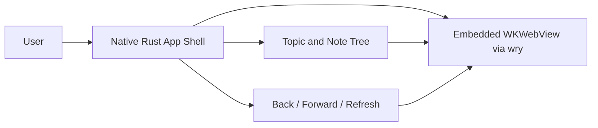

# Research: Framework and WebKit Embedding

## Goal

Identify a practical Rust-based macOS app stack for a viewer-only notes application with:

- Native macOS desktop UI
- A left navigation pane and right content pane
- Embedded WebKit rendering for local `index.html` note content
- Browser-style back, forward, and refresh controls

## Findings

### 1. `WKWebView` is the right rendering primitive on macOS

Apple’s WebKit documentation centers macOS app embedding around `WKWebView`, which is the standard native component for displaying interactive web content in AppKit-based applications.

Implication:

- The design should target `WKWebView` semantics, even if a Rust wrapper crate is used.
- This matches the user requirement to use WebKit and gives native browser navigation support.

Source:

- Apple WebKit overview: https://developer.apple.com/documentation/webkit/webkit-for-appkit-and-uikit

### 2. `wry` is the strongest Rust-accessible WebKit path

The `wry` crate is explicitly a Rust WebView rendering library, and on macOS its `WebView` is created as an `NSView` subview of the parent window’s content view.

Implication:

- `wry` is a practical fit for the right-hand note rendering pane.
- It avoids building a raw Objective-C/AppKit bridge from scratch.
- It already exposes browser-like behavior at the WebView layer, which should make back/forward/reload straightforward.

Sources:

- `wry` crate docs: https://docs.rs/wry
- `wry::WebView` platform notes: https://docs.rs/wry/latest/wry/struct.WebView.html
- `wry` repository: https://github.com/tauri-apps/wry

### 3. Pairing `wry` with a Rust window/event-loop layer is the practical architecture

`wry` requires a running event loop and a compatible window handle. Its docs explicitly call out using a windowing library such as `tao` or `winit`.

Implication:

- The architecture should treat the app shell and event loop as one layer, and the embedded WebKit view as another.
- A split-view UI can be built either by:
  - using a native macOS/AppKit split view plus a child webview, or
  - using a Rust window/event-loop framework and embedding the webview into part of the window.

Design inference:

- For the first version, the lowest-risk path is likely a `tao` + `wry` style architecture, with custom left-pane UI and a single embedded webview for the selected note.
- This is an inference from the crate docs, not an explicit recommendation from the sources.

Source:

- `wry` crate docs: https://docs.rs/wry

### 4. Tauri is not a good fit for this specific app shell

Tauri also exposes webviews, but its architecture is oriented around building the application UI itself as web content. For this project, the user wants a native macOS viewer around local HTML notes, with the note itself occupying the right pane.

Implication:

- Tauri would likely add unnecessary architectural indirection.
- The simpler path is a direct Rust desktop shell plus `wry`/WebKit.

Related source:

- Tauri webview docs: https://docs.rs/tauri/latest/tauri/webview/struct.Webview.html

## Tradeoffs

### Recommended direction

- Use `wry` for the embedded WebKit content area.
- Use a Rust-native desktop shell/event loop around it rather than a web-UI-first shell.

### Benefits

- Direct alignment with the WebKit requirement
- Better fit for a viewer-only native desktop application
- Lower conceptual overhead than using Tauri for this use case

### Risks

- The left tree UI may still require custom native shell work rather than an out-of-the-box split-view widget.
- `wry` gives the webview, but not the whole application structure.

## Component Relationship

