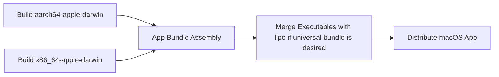

# Research: Packaging, Logging, and macOS Constraints

## Goal

Confirm practical choices for:

- Owner-readable error logs
- Support for Intel and Apple Silicon Macs
- Basic macOS target constraints relevant to the app

## Findings

### 1. `tracing-appender` is a reasonable file-logging mechanism

The `tracing-appender` crate provides rolling and non-rolling file appenders and is designed to integrate with the Rust `tracing` ecosystem.

Implication:

- The app can write a persistent log file for invalid note folders and load/render failures.
- A non-rolling or daily-rolling log file is sufficient for the first version.

Sources:

- `tracing-appender` docs: https://docs.rs/tracing-appender/latest/tracing_appender/
- rolling module docs: https://docs.rs/tracing-appender/latest/tracing_appender/rolling/

### 2. Supporting both Intel and Apple Silicon means building both macOS targets

The Rust platform-support docs list `aarch64-apple-darwin` for Apple Silicon and `x86_64-apple-darwin` for Intel macOS. Apple’s universal binary guidance explains that separate architecture builds can be merged into one universal binary with `lipo`.

Implication:

- Release packaging should explicitly build both macOS targets.
- If a single app bundle is desired, the final packaging step should merge the architecture-specific binaries into a universal binary.

Sources:

- Rust platform support for Apple Darwin: https://doc.rust-lang.org/nightly/rustc/platform-support/apple-darwin.html
- Apple universal binary guidance: https://developer.apple.com/documentation/apple-silicon/building-a-universal-macos-binary

### 3. macOS version targeting needs to be chosen deliberately

Rust’s Apple Darwin target documentation notes different minimum supported OS versions for x86 and ARM targets, and that deployment target can be raised per binary with `MACOSX_DEPLOYMENT_TARGET`.

Implication:

- The design should declare an explicit minimum macOS version rather than leaving it implicit.
- That version decision may be influenced by the final UI shell or WebKit wrapper dependencies.

Source:

- Rust platform support for Apple Darwin: https://doc.rust-lang.org/nightly/rustc/platform-support/apple-darwin.html

## Packaging Flow

## Tradeoffs

### Recommended direction

- Use `tracing` plus `tracing-appender` for log files.
- Plan release packaging around dual-target builds from the start.

### Benefits

- Error logging remains inspectable without polluting the UI.
- Packaging work is explicit rather than deferred until late in the project.

### Risks

- Universal packaging adds a release step beyond plain `cargo build`.
- Some transitive native dependencies may affect the eventual minimum macOS version.
